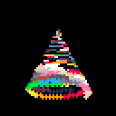
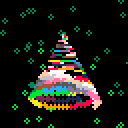

# `doodles`

Animated doodles crafted using the [`doodlekit`](https://github.com/lucasepe/doodlekit).

Whether you're a nostalgic coder or a modern enthusiast, `doodlekit` allows you to craft captivating GIF animations with ease.

```go
scenes := []doodlekit.Scene{
    clear.Scene(0),
    glitters.Scene(),
    xmastree.Scene(),
}

doodlekit.NewLoop("glitters-xmastree",
    doodlekit.OutDir("_doodles"),
    doodlekit.StopAfter(15),
).Run(scenes)
```

 &nbsp;&nbsp;&nbsp; **`+`** &nbsp;&nbsp;&nbsp;  &nbsp;&nbsp;&nbsp; **`=`** &nbsp;&nbsp;&nbsp; 

## Gallery

Check out the complete [doodles gallery here!](GALLERY_1.md)


## Share Your Doodles

Let everyone enjoy the amazing doodles you create with DoodleKit! Share your animations on X (formerly Twitter) using the hashtag #doodlekit. 

```
Check out my latest doodle created with https://github.com/lucasepe/doodlekit ! 🎨✨
#doodlekit #golang #doodles #creativecoding
```

By sharing your creations, you can inspire others!


### Contributing

Contributions from the community are super welcome! If you create a cool doodle using [`doodlekit`](https://github.com/lucasepe/doodlekit), please share it!. 

Here's how you can contribute:

1. Fork the repository
2. Create your feature branch (`git checkout -b feature/amazing-doodle`)
3. Commit your changes (`git commit -m 'Add Amazing Doodle'`)
4. Push to the branch (`git push origin feature/amazing-doodle`)
5. Open a pull request

### License

This project is licensed under the BSD 2-Clause License. See the [LICENSE](LICENSE) file for details.
